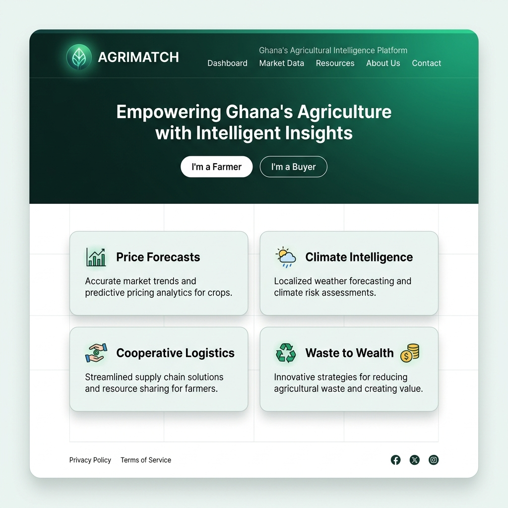
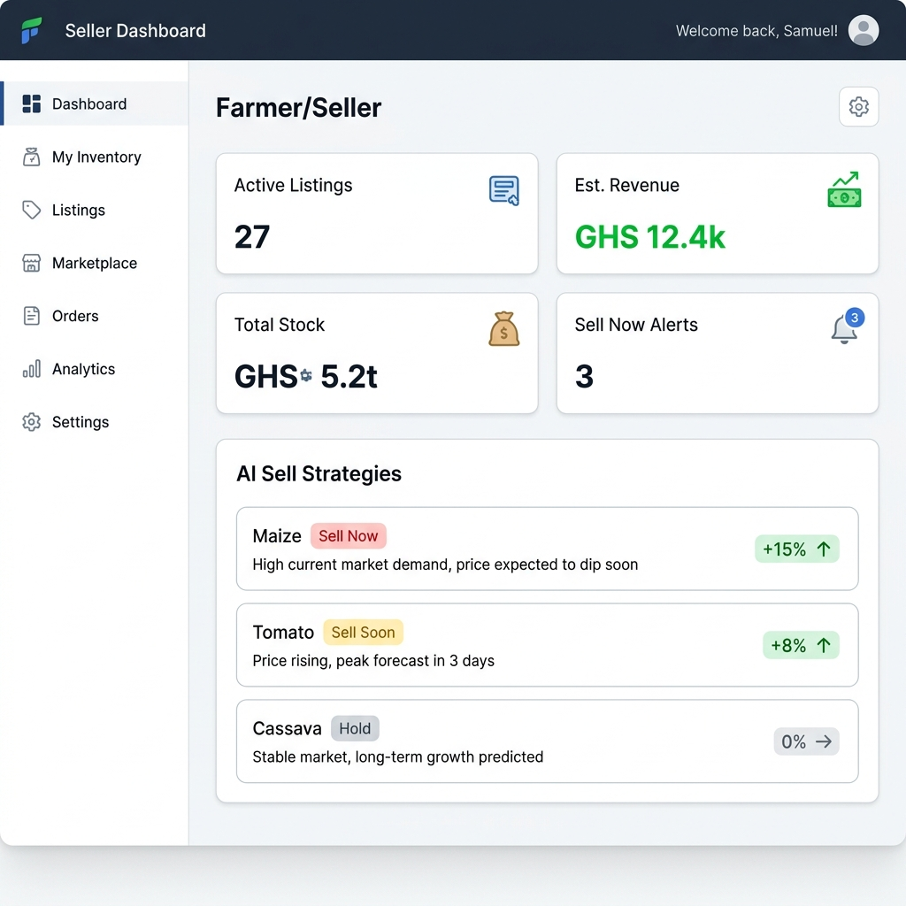
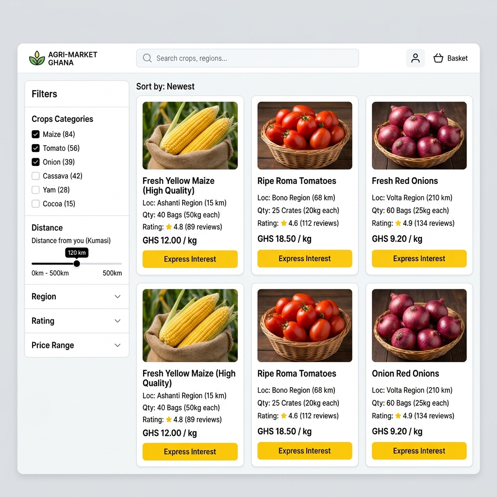
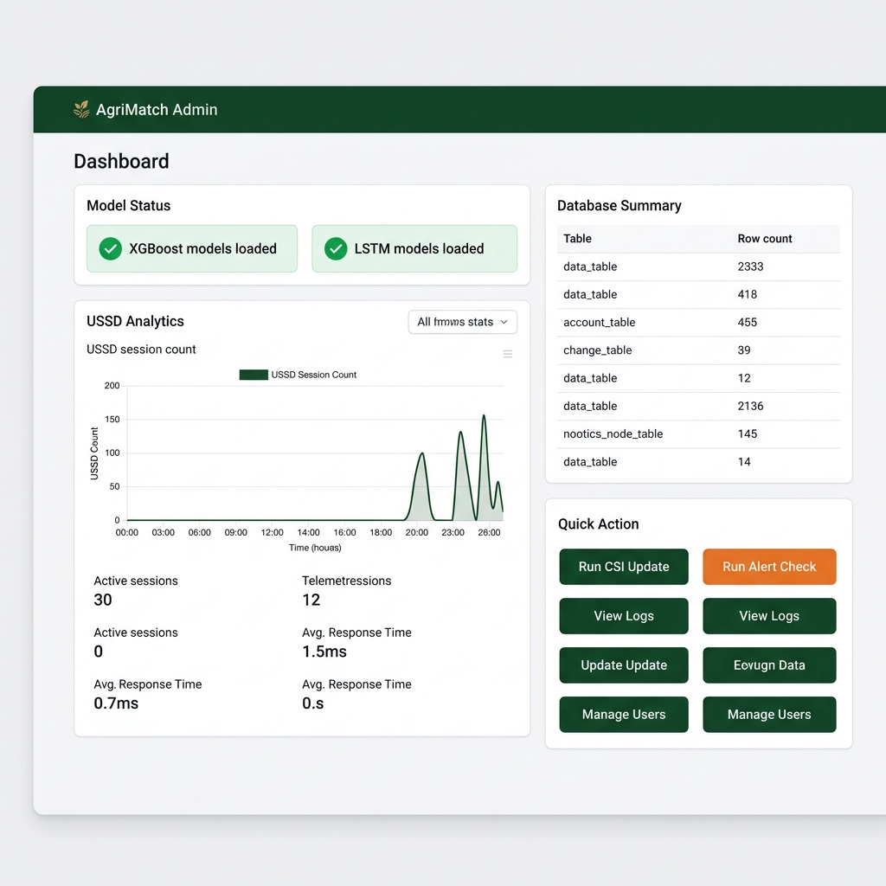
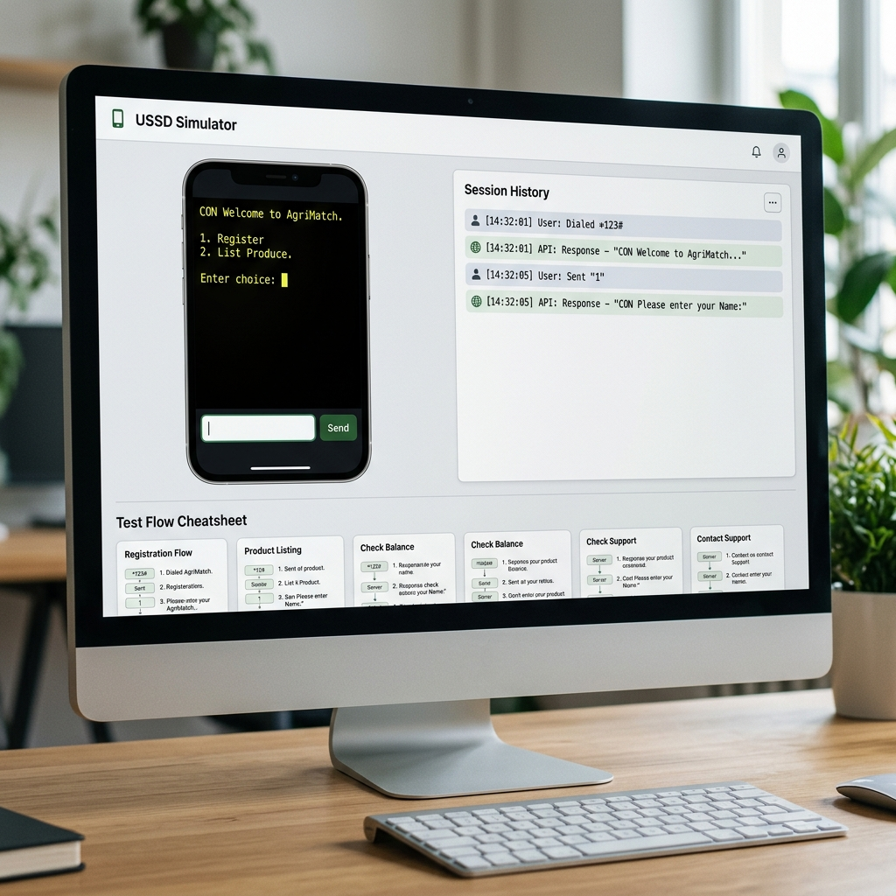

# AgriMatch: Comprehensive Web Interface User Guide & Tutorial

Welcome to the **AgriMatch** User Guide. This document provides a detailed walkthrough of the AgriMatch platform, explaining how users (Farmers, Buyers, and Administrators) interact with the web interface. It outlines where the data comes from, details system features, and presents a strategic pitch framework to help present this platform to investors and funding panels.

---

## 1. Landing & Welcome Page

The Landing Page serves as the gateway to AgriMatch, designed to route users to their respective roles (Farmers or Buyers) while showcasing the core capabilities of the platform.



### Features & Layout
- **Role Redirection**: Clear calls-to-action redirecting users via "I'm a Farmer" (routes to `/seller`) or "I'm a Buyer" (routes to `/shop`).
- **Platform Pillar Cards**: Summarizes the four pillars of AgriMatch: Price Forecasts, Climate Intelligence, Cooperative Logistics, and Waste to Wealth.
- **UN SDG Badges**: Highlights the platform's contribution to UN Sustainable Development Goals (SDG 1: No Poverty, SDG 2: Zero Hunger, SDG 8: Decent Work, SDG 12: Responsible Consumption, SDG 13: Climate Action).

### Data Provenance
- **Static Copywriting**: Pillar descriptions and SDG details are statically defined in the Next.js frontend code.
- **Platform Analytics Stats**: The statistics strip showing:
  - *265 XGBoost price models*
  - *44 Ghana markets covered*
  - *260 Districts monitored*
  - *16 Crop types supported*
  
  These numbers represent the actual scale of the database schema and trained model baselines. In production, these are dynamically fetched from the system configurations and database metrics.

---

## 2. Farmer / Seller Dashboard

The Seller Dashboard is designed for smallholder farmers (and field agents registering crops on their behalf) to manage active stock listings, view estimated revenue, and receive AI-generated selling strategies.



### Features & Layout
- **Key Metrics**: Displays active listings count, total stock in metric tons, estimated revenue (computed using model-forecasted prices), and sell-now warnings.
- **AI Sell Strategies**: A predictive module powered by XGBoost and LSTM forecasting models. It lists recommendations:
  - **Sell Now** (Red Tag): Suggests immediate sale due to pending climate alerts (e.g. drought stress) or projected price peaks.
  - **Sell Soon** (Yellow Tag): Suggests selling within a short window due to minor price dips or moderate weather warnings.
  - **Hold** (Gray Tag): Advises holding inventory for price appreciation.
- **Add Listing Form**: Allows quick listing of crops by entering crop type, quantity in bags (1 bag = 100 kg), and the expected harvest date.
- **My Listings Table**: Lists active declarations with details on quantities, harvest date, estimated forecast price, and byproduct count.

### Data Provenance
- **Demonstration Seed Data**: Pre-seeded with a default farmer profile (**Farmer Kofi, ID 1**) residing in District 32.
- **Listing Data**: Real database records loaded directly from the `farmer_declarations` table via `/api/declarations/farmer/1`.
- **Forecast Prices & Revenue**: The estimated revenue of `GHS 12,400` is computed dynamically by multiplying the quantity of active listings by the 30-day forecast price generated by the models in `clean_prices`.
- **CSI & Climate Alerts**: The "Climate Watch" and "Alert" chips are driven by satellite climate telemetry loaded in the `climate_indicators` table (see CSI Engine below).

---

## 3. Buyer Marketplace (Shop Catalog)

The Buyer Marketplace allows wholesale agricultural buyers, food processors, and exporters to discover produce listings, filter by distance, review quality matches, and express interest.



### Features & Layout
- **Sidebar Filters**: Filter listings by crop type (Maize, Tomato, Onion, Cassava, Rice, Plantain) and maximum distance radius (50 km, 100 km, 200 km, or Any).
- **Interactive Crop Tabs**: Rapidly switch between produce categories.
- **Match Score Rating**: Displays a decimal score (e.g. `4.8/5.0` stars) indicating the algorithmic quality of the listing match.
- **Landed Logistics Costs**: Shows calculated distance in kilometers and delivery rates.
- **Express Interest Button**: Allows the buyer to instantly request contact details for the farmer to coordinate purchases.

### Data Provenance
- **Proximity & Distance Calculations**: Distances are computed in the database using the geographical coordinates (centroid latitude and longitude) of the buyer's district (**District 32**) compared to the farmer's district in the `ghana_districts` table.
- **Logistics Pricing**: Derived from base transport rates in the `transport_providers` table. If the route is 120 km and the provider charges `GHS 4.00/km`, the delivery cost is calculated as `GHS 480`.
- **AI Match Score**: The rating score is dynamically computed based on:
  1. Proximity (shorter distance increases score).
  2. Competitive pricing compared to market averages.
  3. Harvest timing overlap.
  4. Climate Risk Flag (lower CSI flag increases match score).

---

## 4. Product Detail & Price Forecast Page

When a buyer clicks a listing card, they are taken to the Product Detail Page. This page houses the pricing analysis, harvest schedule, and the price projection visualization.

### Features & Layout
- **Recharts Price Forecast Chart**: A clean line chart plotting future crop price trends (30, 60, and 90-day outlooks) alongside confidence interval bounds.
- **Harvest Timeline Warning**: Green indicators ("Ready for collection") or yellow/orange alerts ("Harvest in 12 days") warning the buyer of produce readiness.
- **Quantity Selector & Reservation Box**: Allows selecting the quantity of bags (100kg each) and calculates the total estimated cost in real-time. Buyers can click "Reserve Now" to block the inventory.
- **Verified Badges**: Displays validation checklist icons for climate checks, AI forecasts, and transport eligibility.

### Data Provenance
- **Line Chart Forecast Points**: Plotted directly from `/api/forecast/[crop]/[market]`. These represent predictions generated by our backend **XGBoost and LSTM ML models** trained on WFP HDX and MoFA SRID data. If local data is insufficient, baseline regional averages are plotted.
- **Estimated Order Cost**: Calculated in JavaScript by multiplying the input quantity by the model's projected crop price for that harvest month.

---

## 5. Admin Dashboard & Telemetry

The Admin Dashboard provides platform operators with complete system visibility, data pipeline control, USSD logging, and ML model monitoring.



### Features & Layout
- **Model Health Tracker**: Displays status metrics for ML models (`xgboost_models` count, `lstm_models` count, and `delay_classifier` status).
- **USSD Analytics (*384#)**: Real-time telemetry showing today's session counts, weekly sessions, active calls, and session drop-off zones.
- **Database Row Counts**: Live count display of key system tables.
- **Job Scheduler Status**: Shows active schedules for automated daily scrapers and indicators (CHIRPS precipitation updates, NASA POWER climate indicators).
- **Quick Action Triggers**: Allows admins to trigger critical scripts manually:
  - **Run CSI Update**: Re-evaluates drought indices and updates harvest delays.
  - **Run Alert Check**: Sends pending climate or recommendation SMS alerts.
  - **Run Logistics Grouping**: Runs clustering algorithms to group nearby crop listings for truck cost sharing.

### Data Provenance
- **Telemetry and Tables**: All row counts and active session stats represent live database queries executing `COUNT(*)` calculations on the server.
- **Quick Actions**: Triggers live FastAPI endpoints, which run underlying Python modules (e.g. `ingestion/csi_engine.py`, `ingestion/alert_engine.py`).

---

## 6. USSD Simulator (*384#)

Smallholder farmers in Ghana often operate without internet connectivity. To accommodate them, AgriMatch features an offline USSD service. The Admin panel includes a **USSD Simulator** to test this offline channel.



### Features & Layout
- **Virtual Mobile Phone Screen**: Displays retro text representing the phone screen menus (e.g., `CON Welcome to AgriMatch. 1. Register 2. List Produce`).
- **Interactive Keyboard/Input Field**: Type numbers or text (e.g. name, crop quantity) and click "Send".
- **Session History Log**: Logs request strings (joined by `*`) and responses.
- **Test Flow Cheatsheet**: Highlights step-by-step numbers to dial to test registration and produce declarations.

### Data Provenance
- **Live Database Impact**: This simulator communicates directly with the FastAPI server via `/api/ussd` parameters. 
- **Real Registration & Listing**: When you complete a flow in the USSD simulator (e.g. registering a farmer or listing 50 bags of maize), the data is immediately written to the PostgreSQL database. The new listing will instantly appear in the **Seller Dashboard** and the **Buyer Marketplace**.

---

## 7. How the Systems Work Behind the Scenes

AgriMatch is powered by a robust Python pipeline that runs on a daily/weekly schedule:

```mermaid
graph TD
    subgraph Ingestion
        HDX[HDX API - WFP Prices] --> DataClean[Transformers & Validators]
        MoFA[MoFA SRID Inbox - Excel] --> DataClean
        CHIRPS[CHIRPS API - Precipitation] --> CSIEngine[CSI Engine]
        NASA[NASA POWER API - Temp/Solar] --> CSIEngine
        Fuel[Daily Fuel Scraper] --> LogisticsEngine[Logistics Engine]
    end

    subgraph Database (Neon Postgres)
        DataClean --> CP[clean_prices]
        CSIEngine --> CI[climate_indicators]
        Fuel --> LC[logistics_costs]
    end

    subgraph ML & Intelligence
        CP --> ML[XGBoost & LSTM Training]
        ML --> Forecast[Price Forecast API]
        CI --> CSIDec[Harvest Delay Classifier]
    end

    subgraph Interfaces
        Forecast --> Web[Next.js Web App]
        CSIDec --> SMS[Alert Engine - SMS]
        USSD[USSD Simulator / Phone] --> API[FastAPI Server]
        API --> Database
    end
```

### Ingestion Clients
1. **HDX Client (`ingestion/hdx_client.py`)**: Fetches WFP historical food prices for Ghana.
2. **MoFA Client (`ingestion/mofa_client.py`)**: Monitors the `data/mofa_inbox` folder for Excel spreadsheets provided by the Ministry of Food and Agriculture, parses them, and skips duplicates.
3. **Daily Fuel Scraper (`ingestion/fuel_scraper.py`)**: Scrapes local retail fuel prices in Ghana to adjust transportation rates.

### The CSI Engine (Climate Stress Indicator)
The CSI Engine (`ingestion/csi_engine.py`) retrieves satellite climate data (CHIRPS precipitation and NASA POWER temperature/solar radiation) across all 260 Ghana districts. It computes drought indicators and estimates if a farmer's crop harvest will be delayed. If a high drought stress flag is registered, a delay classifier automatically updates the listing's `adjusted_harvest_date` and warns buyers.

### The Alert Engine
The Alert Engine (`ingestion/alert_engine.py`) regularly scans active crop declarations. If a climate risk changes, it automatically fires SMS notifications to the farmer's registered phone number (e.g., *"AgriMatch Alert: Maize harvest in Ashanti Region is at risk of drought delay. Recommended Action: Harvest early or cover crops. Ref# AM-12"*).

---

## 8. Pitching AgriMatch to Investors (Winning Funding)

When presenting AgriMatch to investors or grant panels (e.g., agricultural development funds, climate-tech VCs, social impact groups), use this framework to demonstrate how AgriMatch outpaces standard agricultural marketplaces.

### The Problem (Why Standard Platforms Fail)
- **Extreme Price Volatility**: Farmers sell immediately after harvest when prices are lowest because they lack pricing power. Standard platforms display current prices, which does not help farmers plan.
- **Climate Shocks**: Unpredictable weather shifts trigger crop failures or delays, rendering listing boards obsolete. Standard platforms do not account for weather risk.
- **High Logistics Costs**: Fragmented, low-volume transport makes shipping small crop yields to main markets prohibitively expensive.

### The AgriMatch Solution (Our Unfair Advantage)
1. **Predictive Pricing, Not Just Matching**: 
   - *Pitch Detail*: "We don't just match buyers and sellers; we provide future predictability. Our XGBoost + LSTM models predict market-specific prices up to 90 days out, allowing farmers to time their harvest and command better rates, while giving buyers price visibility."
2. **Climate Risk Mitigation Built-In**:
   - *Pitch Detail*: "We integrate live satellite weather telemetry (CHIRPS & NASA POWER) to calculate Climate Stress Indicators (CSI) for every district. This automatically predicts harvest delays and spoilage risk, sending SMS warnings to offline farmers. This keeps our supply chain resilient and transparent."
3. **Cooperative Logistics Cost Sharing**:
   - *Pitch Detail*: "Our logistics grouping engine clusters nearby crop listings headed to the same market hubs, enabling farmers to share truck rentals. This cuts transportation overhead by up to 50%, unlocking margins that previously vanished in transit."
4. **Circular Economy Integration (Waste to Wealth)**:
   - *Pitch Detail*: "We support a zero-waste agricultural economy. Farmers can list and monetize crop byproducts (husks, stalks, skins) for organic fertilizer or bioenergy production, creating secondary revenue streams."
5. **Universal Digital Inclusion (USSD + SMS)**:
   - *Pitch Detail*: "We bypass the smartphone barrier. Our offline USSD interface (*384#) allows farmers with basic analog phones to register, check prices, and list produce. We bring digital transformation to 100% of the smallholder population."

### Key Investment Metrics
- **Scalable Technology**: Built on Next.js, FastAPI, and Neon Postgres, handling over 1.6M rows of daily climate records and 37k+ cleaned price entries.
- **Dual-Impact Revenue Model**: SaaS licensing for wholesale buyers, carbon offset possibilities through byproduct reuse, and small convenience fees on cooperative transport transactions.
- **Proof of Concept Ready**: Complete local sandbox environment featuring trained ML models, responsive web dashboard, active USSD emulator, and database pipelines.
